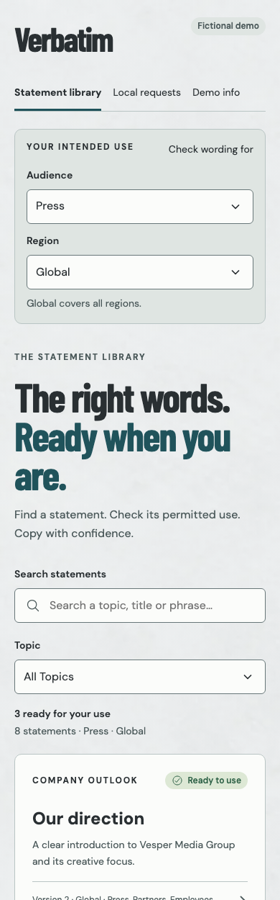

# Verbatim

A mobile-first statement library for press officers and regional communications teams who need approved wording while working away from a desk. This P303 portfolio case study is built for **Vesper Media Group**, an entirely fictional organization. Find wording, verify approval and permitted use, then copy the exact eligible statement.

- Live app: [Open Verbatim](https://ready-to-say.vercel.app)
- Public repository: [verbatim](https://github.com/andy-fitts-slalom/verbatim)
- Specification: [BRIEF.md](BRIEF.md)
- Handoff: [docs/PROGRESS.md](docs/PROGRESS.md)

Built with Vue 3, TypeScript, Vite and Ionic Vue. Data and fonts ship with the app; there is no backend or runtime service to configure. The product is Verbatim; its production URL intentionally retains the earlier name.



Screenshot of the Vesper UI 3.0 local production build at 390px.

## Try the workflow

1. Start with the default **Press / Global** scope and open the company statement.
2. Check the approval metadata and permitted use, then copy the exact wording. A newer draft does not hide the usable approved version.
3. Open the expired streaming statement to see why copying is blocked and request updated wording with a reason.
4. Open Requests to see the saved local demonstration request; reload to check persistence.
5. In Demo info, confirm Reset to clear requests and restore the default scope.

## Run locally

Vesper UI 3.0.0 supplies the shared presentation. Its release is checked into `vendor/vesper-ui-3.0.0.tgz` and installed from that file. A sibling folder or unpublished registry package is not needed.

Use Node.js 22.12 or newer (Node 22 is used in CI and Vercel) and npm.

```sh
npm ci
npm run dev
```

```sh
npm test             # Domain and seed integrity tests
npm run build        # Type-check and production build
npm run preview      # Serve the production build
npm run test:e2e      # Phone and desktop browser journeys
npm run format:check
npm run format
```

Browser tests use installed Google Chrome locally and Playwright Chromium in CI. Install Chromium for CI-style local testing with `npx playwright install chromium` and run `CI=1 npm run test:e2e`. Build before running browser tests; their preview server uses port 4287. Test a deployed app with `PLAYWRIGHT_BASE_URL=https://ready-to-say.vercel.app npm run test:e2e`.

Open the URL printed by Vite after starting the development server.

## Eligibility

The deterministic library contains 24 versions across eight topics. Its clock is fixed at **2025-10-21**, shown in Demo info. Dates are inclusive: a statement is usable from its effective date through its expiry date.

The copy action rechecks that wording is approved, effective, unexpired, allowed for the selected audience and region, and not superseded by a currently usable approved replacement. Global wording can serve a selected region; a regional statement cannot serve a global request. Audiences never inherit one another's permissions. Replacement links stay within a family and cycles fail closed.

The library selects the highest usable version, so a draft or future approval never hides a current approval. Historical versions stay inspectable, with blocked copying and replacement or update-request recovery. These are demonstration rules, not authentication or access control.

## Local persistence and recovery

Requests and audience/region preferences use local storage under `ready-to-say-v1`. Search and topic filters live in the URL and survive browser back navigation. Requests record their creation time using the device clock; approval eligibility always uses the demo clock.

Update requests are **browser-local demonstrations**. No person is notified, no backend receives them, and nothing synchronizes across devices. Storage failures display a session-only warning. Reset requires confirmation, clears demo requests, and restores Press / Global. Seed statements are immutable.

Clipboard success writes only the exact statement text. If permission or browser support prevents copying, the app selects the exact wording in a read-only field and explains how to use the device Copy command. Ineligible wording has no application copy or manual-copy action.

## Accessibility and layout

Ionic Vue provides the app shell and compatible router integration. Semantic forms have explicit labels, visible focus, generous targets, status announcements, reduced-motion support, and bottom safe-area padding. Recovery forms move focus into view. Status uses text and symbols as well as color. Narrow phones use a single-column library; desktop uses cards and a separate approval panel.

Automated axe checks and keyboard/browser tests cover core pages. They do not replace assistive-technology or physical-device testing. Vesper UI supplies the parent V-and-star mark, locally hosted fonts, light/mobile semantic tokens, native Vue primitives and Ionic adapter. Domain rules and records remain application-owned. Fonts are bundled locally, with notices in [public/licenses](public/licenses).

## Deployment

Vercel project **Verbatim** (`verbatim`), team **Andy-Protogen** (`andy-protogen`), uses Vite, `npm ci`, `npm run build`, output `dist`, and Node 22. GitHub is connected and pushes to the production branch `main` deploy automatically. `vercel.json` supplies history-route fallbacks for direct statement URLs and refreshes. See [docs/VERIFICATION.md](docs/VERIFICATION.md) for the passing local, CI and deployed-browser checks.

No runtime secrets or environment variables are required. `.env*`, `.vercel/`, dependencies, and browser artifacts are ignored. The GitHub workflow builds and verifies pushes and pull requests. The production domain remains `ready-to-say.vercel.app`. See [AGENTS.md](AGENTS.md) for contributor publication constraints.

## Verification

The September 30, 2026 release evidence records 18 unit tests, 60 local and 60 production browser tests, production build, formatting and GitHub CI passing. A separate live clipboard check matched the canonical statement exactly. See [verification](docs/VERIFICATION.md) for revisions and limitations and [progress](docs/PROGRESS.md) for the dated history. Historical migration records describe previous releases; current presentation uses Vesper UI.

## Project structure

- `src/data/statements.json`: invented families and statement versions
- `src/domain/`: eligibility, version selection, and TypeScript types
- `src/Workspace.vue`: library, detail, recovery, requests, and demo views
- `src/state.ts`: validated browser-local persistence
- `tests/`: domain and browser regression checks
- `docs/`: data dictionary, decisions, progress, and verification evidence

## Limits and license

This prototype has no authentication, shared approvals, notifications, backend, native packaging, service worker, or offline synchronization. Browser clipboard permissions vary. The Ionic runtime produces a relatively large JavaScript bundle; future performance work could split the views and further reduce shipped components.

Original prototype code is MIT licensed; see [LICENSE](LICENSE). Dependency licenses are retained in [public/licenses/THIRD-PARTY.txt](public/licenses/THIRD-PARTY.txt); regenerate after runtime dependency changes with `node scripts/licenses.mjs`.
